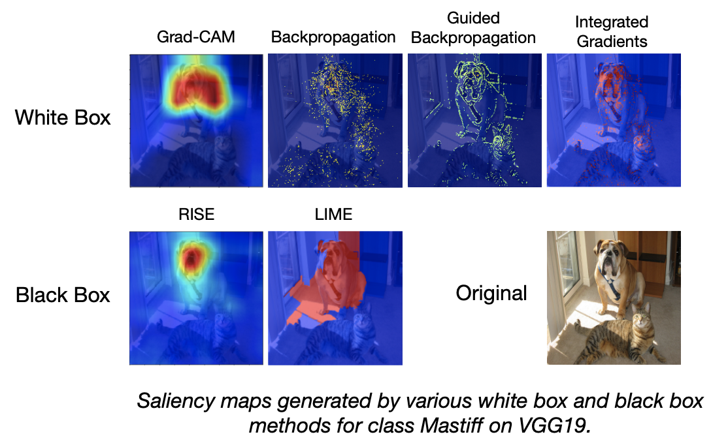
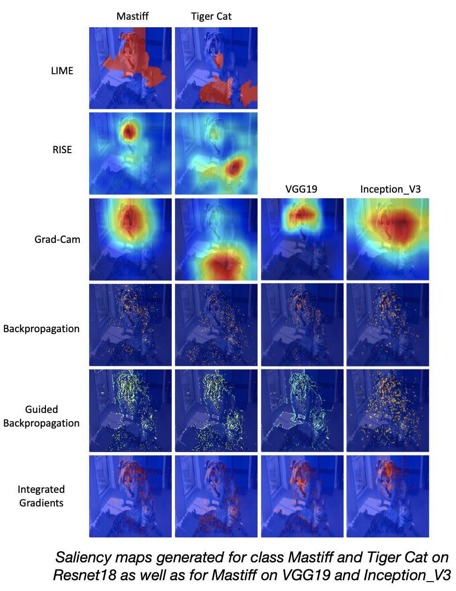
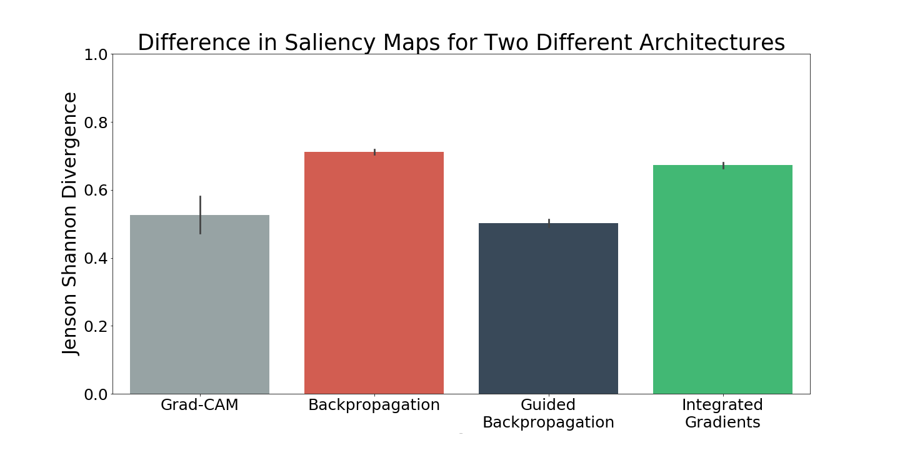

# explain-eval
Developing Metrics for Evaluating Explainability 

## Running Technqiues
Current techniques implemented:
1. [LIME](techniques/LIME/LIME.py)
2. [RISE](techniques/RISE/rise_utils.py)
3. [Grad-CAM](techniques/Grad_CAM/main_gcam.py)
4. [Backpropagation](techniques/Grad_CAM/main_gcam.py)
5. [Guided Backpropagation](techniques/Grad_CAM/main_gcam.py)
6. [Integrated Gradients](techniques/Integrated_Gradients/integrated_gradients.py)

TODO: Deconvolution, Guided Grad-CAM, Grad-CAM++, Excitation BP

All techniques are generated through the API [gen_grounding](techniques/generate_grounding.py). For more examples see 
[this notebook](notebooks/Getting_Started.ipynb) 

### Running a Specific Technique
`python techniques/generate_grounding.py --TECHNIQUE [lime, rise, gcam, bp, gbp, ig] --path [PATH TO IMAGE] --model [NAME OF MODEL] --deivce [DEVICE NUMBER] --index [TOPK INDEX] --result-path [RESULT PATH FOLDER] --name [CLASS NAME FOR SAVING]`

Here is an example using resnet18 for just Grad-CAM:
`python techniques/generate_grounding.py --technique gcam --path samples/cat_dpg.png --model resnet18 --result-path ./`

### Running All Techniques
`python techniques/generate_grounding.py 
--all --path [PATH TO IMAGE] --model [NAME OF MODEL] --deivce [DEVICE NUMBER] --index [TOPK INDEX] --result-path [RESULT PATH FOLDER] --name [CLASS NAME FOR SAVING]`

Here is an example using resnet18 for all techniques:
`python techniques/generate_grounding.py --all --path samples/cat_dpg.png --model resnet18 --result-path ./`

## Results

#### Examples of White Box(gradient based) and Black Box(perturbation based) Techniques

#### Explanations with Different Architectures and Different Classes

 

